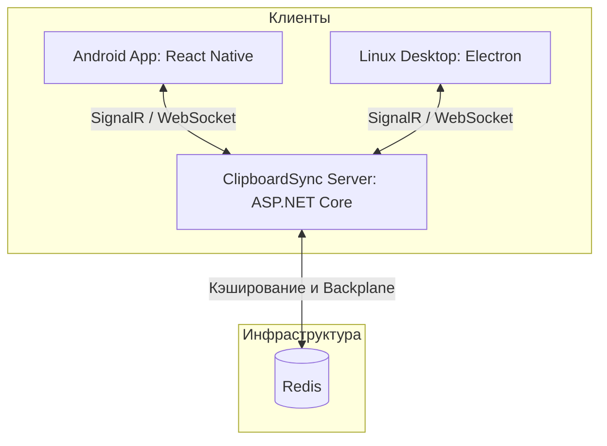

# ClipboardSync 📋📱💻

**ClipboardSync** — это система для синхронизации буфера обмена между мобильными устройствами (Android/iOS) и настольными операционными системами (Linux/Windows) в режиме реального времени. 

Проект разработан для того, чтобы связать ваш Linux-десктоп и Android-смартфон, позволяя мгновенно переносить скопированный текст (ссылки, команды, заметки) между ними без необходимости отправлять сообщения самому себе в мессенджерах.

---

## 🏗 Архитектура проекта

Система состоит из трех основных компонентов:



### 1. [ClipboardSyncServer](file:///C:/Users/buryy/Documents/antigravity/optimistic-hopper/src/ClipboardSyncServer) 🖥
Центральный сервер координации, написанный на **C# (ASP.NET Core)**.
* **SignalR**: Используется для поддержки постоянного двустороннего соединения с клиентами и мгновенной рассылки обновлений буфера обмена.
* **Redis**: Выступает в роли кэша и backplane для масштабирования SignalR-подключений.
* **JWT Bearer Authentication**: Обеспечивает безопасную авторизацию устройств.

### 2. [ClipboardSyncDesktop](file:///C:/Users/buryy/Documents/antigravity/optimistic-hopper/src/ClipboardSyncDesktop) 💻
Десктопный клиент на базе **Electron** и **Node.js**.
* Мониторит локальный буфер обмена ОС и отправляет изменения на сервер.
* Поддерживает работу в системном трее.
* Хранит историю последних 100 записей локально в `~/.config/ClipboardSync/clipboard_history.json`.
* Позволяет быстро открыть окно истории буфера обмена для выбора и вставки записи при запуске приложения с аргументом `--show-clipboard` (рекомендуется привязать к глобальной горячей клавише в вашей DE на Linux).

### 3. [ClipboardSyncApp](file:///C:/Users/buryy/Documents/antigravity/optimistic-hopper/src/ClipboardSyncApp) 📱
Мобильное приложение, созданное на **React Native**.
* **Android Foreground Service**: Использует фоновую службу Android для постоянного мониторинга буфера обмена, обходя ограничения ОС на фоновые процессы.
* **Нативный ClipboardListener**: Кастомный модуль для прослушивания системных событий копирования.
* Интеграция с SignalR для мгновенного приема и передачи данных.

---

## 🛠 Технологический стек

* **Backend**: .NET 8 / ASP.NET Core, SignalR, Redis, Docker & Docker Compose
* **Desktop**: Electron, Node.js, `@microsoft/signalr`, `dbus-native`
* **Mobile**: React Native, `@notifee/react-native`, AsyncStorage, SignalR Client

---

## 🚀 Настройка и запуск

### 1. Запуск сервера (`ClipboardSyncServer`)

Сервер требует запущенного Redis. Проще всего развернуть окружение с помощью Docker Compose:

1. Перейдите в каталог сервера:
   ```bash
   cd src/ClipboardSyncServer
   ```
2. Запустите стек с помощью Docker Compose:
   ```bash
   docker compose up -d
   ```
   *Это поднимет Redis и сам API-сервер, который будет доступен по портам, указанным в `compose.yaml`.*

### 2. Настройка десктопного клиента (`ClipboardSyncDesktop`)

1. Перейдите в каталог десктопного клиента:
   ```bash
   cd src/ClipboardSyncDesktop
   ```
2. Установите зависимости:
   ```bash
   npm install
   ```
3. Настройте адрес сервера в [config.js](file:///C:/Users/buryy/Documents/antigravity/optimistic-hopper/src/ClipboardSyncDesktop/renderer/config.js).
4. Запустите в режиме разработки:
   * **Linux**: `npm run dev`
   * **Windows**: `npm run dev-win`
5. Сборка для Linux:
   ```bash
   npm run build-dev
   ```

> [!TIP]
> В Linux настройте глобальный хоткей (например, `Super + V`) на команду:
> `/путь/к/приложению/ClipboardSync --show-clipboard`
> Это позволит мгновенно вызывать всплывающее окно со списком истории буфера обмена прямо у курсора.

### 3. Настройка мобильного клиента (`ClipboardSyncApp`)

1. Перейдите в каталог приложения:
   ```bash
   cd src/ClipboardSyncApp/src
   ```
2. Установите npm-зависимости:
   ```bash
   npm install
   ```
3. Укажите адрес вашего запущенного сервера в файле [config.js](file:///C:/Users/buryy/Documents/antigravity/optimistic-hopper/src/ClipboardSyncApp/src/config.js).
4. Запустите Metro bundler:
   ```bash
   npm start
   ```
5. Соберите и запустите приложение на подключенном Android-устройстве:
   ```bash
   npm run android
   ```

---

## 🔒 Безопасность

* Авторизация устройств осуществляется с помощью JSON Web Tokens (JWT).
* Обмен данными между клиентами и сервером происходит в зашифрованном виде (при настройке HTTPS на сервере).
* В коде мобильного клиента заложена поддержка шифрования `react-native-aes-gcm-crypto` для будущего сквозного шифрования содержимого буфера.