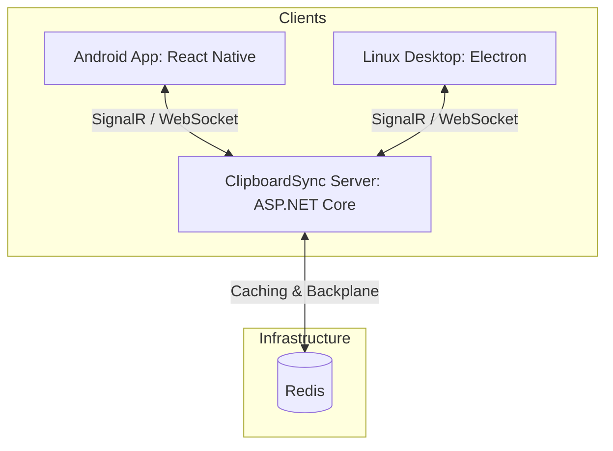

# ClipboardSync 📋📱💻

**ClipboardSync** is a system designed to synchronize your clipboard (text, links, notes) between mobile devices (Android/iOS) and desktop operating systems (Linux/Windows) in real-time.

The project is built to seamlessly connect a Linux desktop and an Android smartphone, allowing you to instantly copy and paste text across devices without having to use messaging apps to send texts to yourself.

---

## 🏗 System Architecture

The system consists of three main components:



### 1. [ClipboardSyncServer](file:///C:/Users/buryy/Documents/antigravity/optimistic-hopper/src/ClipboardSyncServer) 🖥
The central coordination server built with **C# (ASP.NET Core)**.
* **SignalR**: Establishes persistent real-time bidirectional WebSocket connections with clients to instantly broadcast clipboard updates.
* **Redis**: Acts as a caching layer and SignalR backplane for multi-instance scaling.
* **JWT Bearer Authentication**: Secures device connections and operations.

### 2. [ClipboardSyncDesktop](file:///C:/Users/buryy/Documents/antigravity/optimistic-hopper/src/ClipboardSyncDesktop) 💻
A desktop client built with **Electron** and **Node.js**.
* Monitors the local system clipboard and sends changes to the server.
* Supports running in the system tray.
* Stores the last 100 clipboard entries locally in `~/.config/ClipboardSync/clipboard_history.json`.
* Provides a quick-access clipboard history window when launched with the `--show-clipboard` argument (highly recommended to bind to a global hotkey in Linux).

### 3. [ClipboardSyncApp](file:///C:/Users/buryy/Documents/antigravity/optimistic-hopper/src/ClipboardSyncApp) 📱
A mobile client developed using **React Native**.
* **Android Foreground Service**: Runs a background service to constantly monitor the Android clipboard, bypassing OS restrictions on background processes.
* **Native ClipboardListener**: A custom native module for capturing system copy events.
* Integrated with SignalR for instant message sending and receiving.

---

## 🛠 Technology Stack

* **Backend**: .NET 8 / ASP.NET Core, SignalR, Redis, Docker & Docker Compose
* **Desktop**: Electron, Node.js, `@microsoft/signalr`, `dbus-native`
* **Mobile**: React Native, `@notifee/react-native`, AsyncStorage, SignalR Client

---

## 🚀 Setup and Launch Instructions

### 1. Starting the Server (`ClipboardSyncServer`)

The server requires a running Redis instance. The easiest way to spin up the backend is using Docker Compose:

1. Navigate to the server folder:
   ```bash
   cd src/ClipboardSyncServer
   ```
2. Start the stack:
   ```bash
   docker compose up -d
   ```
   *This starts Redis and the API server. The API will be available on the ports defined in `compose.yaml`.*

### 2. Desktop Client Setup (`ClipboardSyncDesktop`)

1. Navigate to the desktop client folder:
   ```bash
   cd src/ClipboardSyncDesktop
   ```
2. Install npm dependencies:
   ```bash
   npm install
   ```
3. Configure the server URL in [config.js](file:///C:/Users/buryy/Documents/antigravity/optimistic-hopper/src/ClipboardSyncDesktop/renderer/config.js).
4. Run in development mode:
   * **Linux**: `npm run dev`
   * **Windows**: `npm run dev-win`
5. Package the application for Linux:
   ```bash
   npm run build-dev
   ```

> [!TIP]
> In Linux, assign a global keyboard shortcut (e.g., `Super + V`) to the following command:
> `/path/to/app/ClipboardSync --show-clipboard`
> This will instantly open the floating clipboard history menu right next to your cursor.

### 3. Mobile Client Setup (`ClipboardSyncApp`)

1. Navigate to the React Native source folder:
   ```bash
   cd src/ClipboardSyncApp/src
   ```
2. Install npm dependencies:
   ```bash
   npm install
   ```
3. Set your server URL in [config.js](file:///C:/Users/buryy/Documents/antigravity/optimistic-hopper/src/ClipboardSyncApp/src/config.js).
4. Start the Metro bundler:
   ```bash
   npm start
   ```
5. Compile and run the app on a connected Android device:
   ```bash
   npm run android
   ```

---

## 🔒 Security

* Device authentication is handled via JSON Web Tokens (JWT).
* Communication between clients and the server is encrypted (when running the server behind HTTPS).
* The mobile application code includes support for `react-native-aes-gcm-crypto` to enable end-to-end encryption of clipboard content in the future.